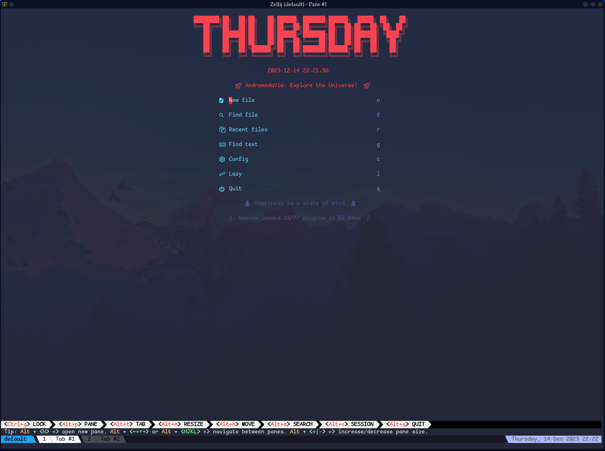
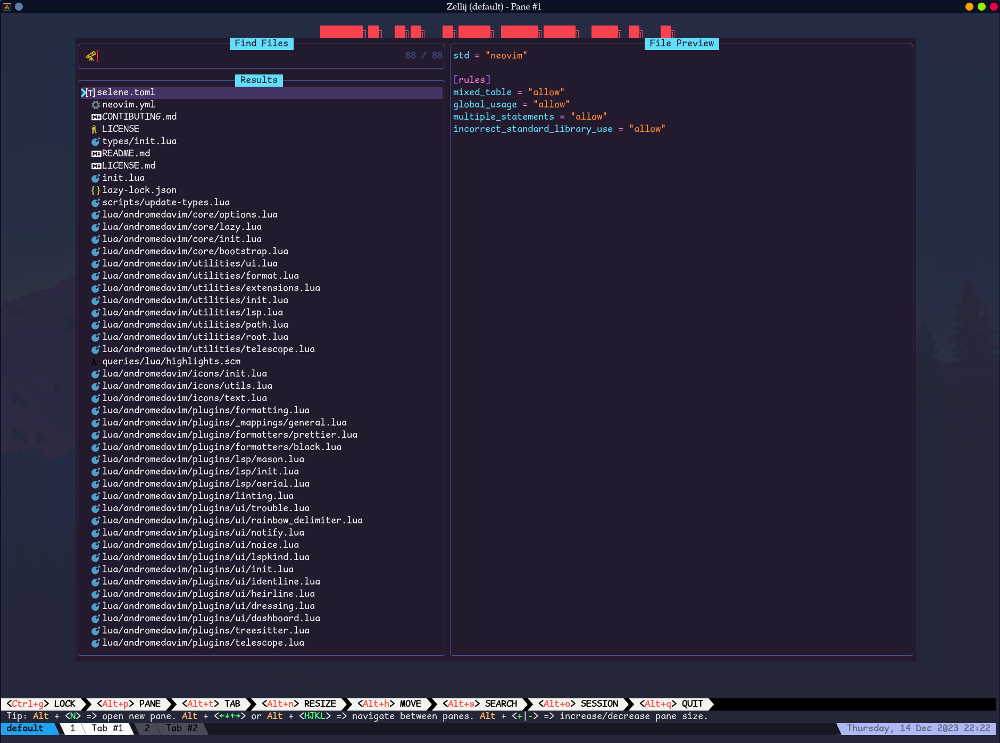
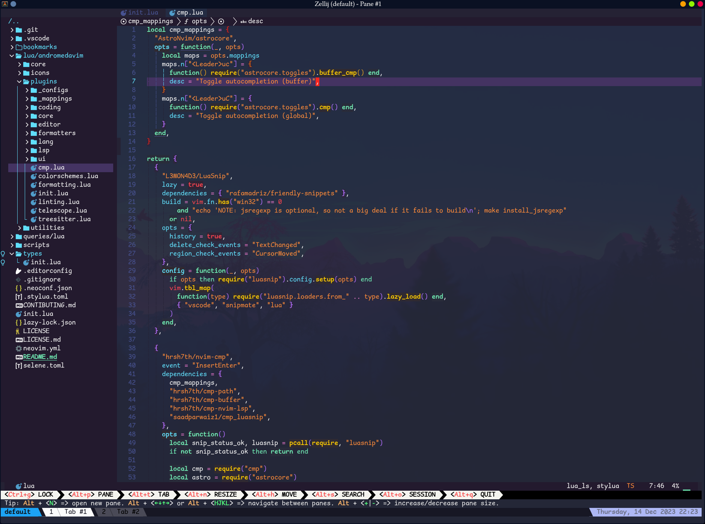

# AndromedaVim (AstroNvim v4+ Style)

**NOTE:** This is for AstroNvim v4+





## Structure

- `kit` - contains the core libraries of AndromedaVim

## 🛠️ Installation

### Make a backup of your current nvim and shared folder

```shell
mv ~/.config/nvim ~/.config/nvim.bak
mv ~/.local/share/nvim ~/.local/share/nvim.bak
mv ~/.local/state/nvim ~/.local/state/nvim.bak
mv ~/.cache/nvim ~/.cache/nvim.bak
```

#### Clone the repository

```sh
git clone https://github.com/lecoqjacob/AstroVimUser ~/.config/nvim
```

#### Start Neovim

```sh
nvim --headless +q
```

## Contributing

We welcome contributions from the community to enhance Review App further. If you're interested in contributing, please read our [Contributing Guidelines](CONTRIBUTING.md) for detailed information on how to get started.

## License

This project is licensed under the [Apache License v2.0](https://github.com/lecoqjacob/AstroVimUser/blob/main/LICENSE).


